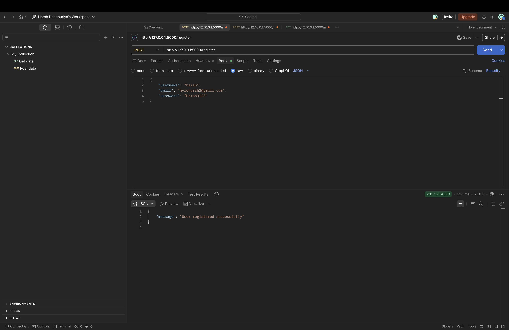
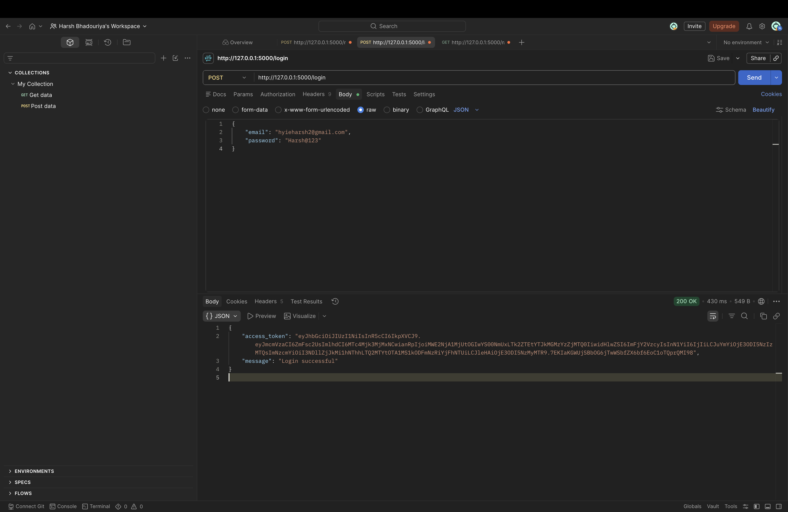
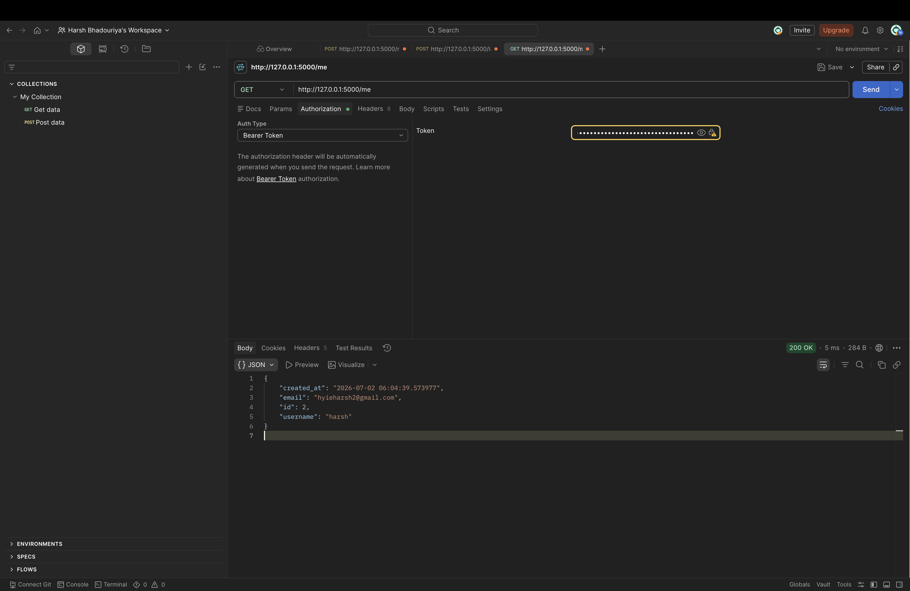
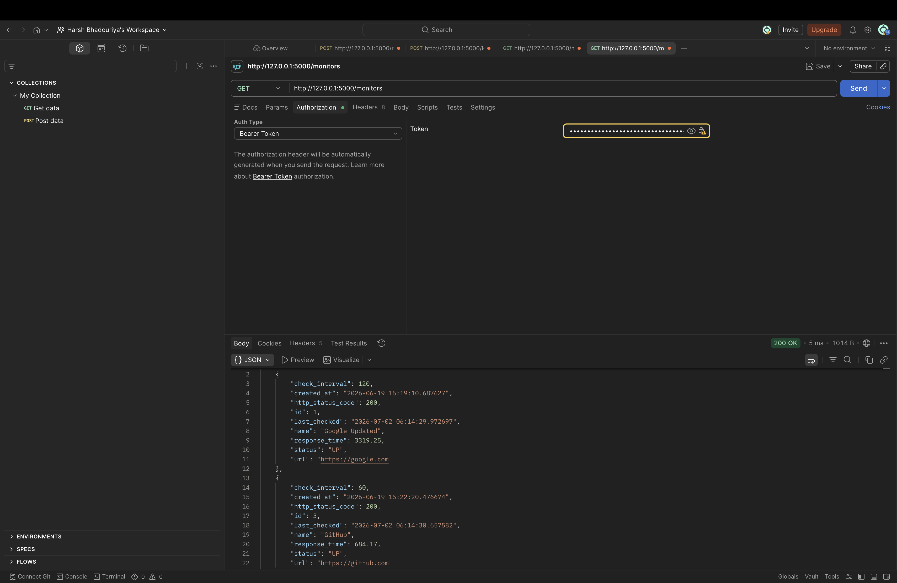
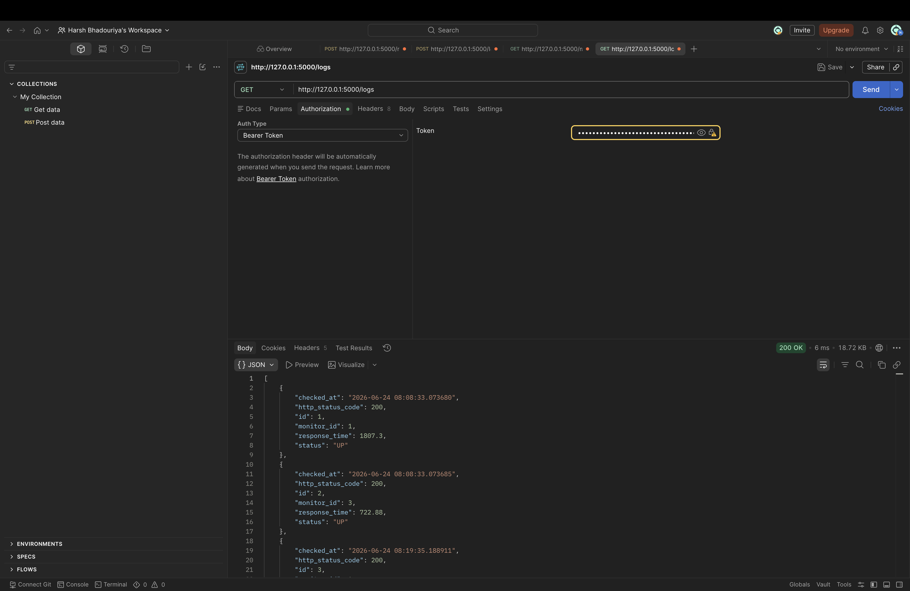

# 🌐 URL Monitoring Service


A production-style backend application built with **Flask** that continuously monitors website availability, tracks response times, stores monitoring history, sends email alerts when websites become unavailable, and secures APIs using **JWT Authentication**.

This project demonstrates backend development concepts including:

- REST API Development
- Authentication & Authorization
- Background Scheduling
- Database Management
- Monitoring Systems
- Email Notifications
- Version Control with Git & GitHub

---

# 📚 Table of Contents

- [Project Overview](#-project-overview)
- [Features](#-features)
- [Tech Stack](#-tech-stack)
- [Project Structure](#-project-structure)
- [System Architecture](#-system-architecture)
- [API Endpoints](#-api-endpoints)
- [API Screenshots](#-api-screenshots)
- [Installation](#-installation)
- [Environment Variables](#-environment-variables)
- [Future Improvements](#-future-improvements)
- [Skills Demonstrated](#-skills-demonstrated)
- [Project Status](#-project-status)
- [License](#-license)
- [Author](#-author)

---

# 📖 Project Overview

URL Monitoring Service is a backend application that automatically monitors website availability.

The application performs scheduled health checks, records response times, stores monitoring logs, sends email alerts whenever a monitored website becomes unavailable, and secures REST APIs using JWT Authentication.

This project was built to demonstrate production-oriented backend development using Flask and related technologies.

---

# ✨ Features

- ✅ Website uptime monitoring
- ✅ Response time tracking
- ✅ HTTP status code monitoring
- ✅ Automatic scheduled health checks
- ✅ Email notifications when websites become unavailable
- ✅ Monitoring history (logs)
- ✅ User Registration
- ✅ User Login
- ✅ JWT Authentication
- ✅ Protected REST APIs
- ✅ CRUD operations for monitors
- ✅ SQLite database using SQLAlchemy ORM
- ✅ Database migrations using Flask-Migrate

---

# 🛠 Tech Stack

| Category | Technology |
|----------|------------|
| Language | Python 3 |
| Framework | Flask |
| ORM | SQLAlchemy |
| Database | SQLite |
| Authentication | Flask-JWT-Extended |
| Password Hashing | Flask-Bcrypt |
| Scheduler | APScheduler |
| Email Service | SMTP (Gmail) |
| Database Migration | Flask-Migrate (Alembic) |
| API Testing | Postman |
| Version Control | Git & GitHub |

---

# 📂 Project Structure

```text
url-monitor-service/
│
├── assets/
│   ├── register-api.png
│   ├── login-api.png
│   ├── me-api.png
│   ├── monitors-api.png
│   ├── logs-api.png
│   └── architecture.png
│
├── database/
├── migrations/
│
├── models/
│   ├── monitor.py
│   ├── monitor_log.py
│   ├── user.py
│   └── __init__.py
│
├── routes/
│   ├── auth_routes.py
│   └── monitor_routes.py
│
├── scheduler/
│   └── job_scheduler.py
│
├── services/
│   ├── email_service.py
│   └── monitor_service.py
│
├── tests/
├── utils/
│
├── app.py
├── config.py
├── extensions.py
├── requirements.txt
├── README.md
└── LICENSE
```

---

# 🏗 System Architecture

```text
                           Client (Postman)
                                   │
                                   ▼
                          Flask REST API
                                   │
      ┌───────────────┬────────────┴────────────┬───────────────┐
      │               │                         │               │
      ▼               ▼                         ▼               ▼
 JWT Authentication  Monitor Service      Email Service     APScheduler
      │               │                         │               │
      └───────────────┴──────────────┬──────────┴───────────────┘
                                     │
                                     ▼
                             SQLAlchemy ORM
                                     │
                                     ▼
                              SQLite Database
```

---

# 📡 API Endpoints

| Method | Endpoint | Description | Authentication |
|--------|----------|-------------|---------------|
| POST | `/register` | Register a new user | ❌ |
| POST | `/login` | Login and receive JWT token | ❌ |
| GET | `/me` | Get current user details | ✅ |
| POST | `/monitors` | Create a new monitor | ✅ |
| GET | `/monitors` | Get all monitors | ✅ |
| GET | `/monitors/<id>` | Get monitor by ID | ✅ |
| PUT | `/monitors/<id>` | Update monitor | ✅ |
| DELETE | `/monitors/<id>` | Delete monitor | ✅ |
| GET | `/logs` | Retrieve monitoring logs | ✅ |
| GET | `/run-check` | Trigger monitoring manually | ❌ |

---

# 📸 API Screenshots

## Register API



---

## Login API



---

## Current User



---

## Get Monitors



---

## Monitoring Logs



---

# ⚙ Installation

## 1. Clone the repository

```bash
git clone https://github.com/hyieharsh/url-monitoring-service.git
```

## 2. Navigate into the project

```bash
cd url-monitoring-service
```

## 3. Create a virtual environment

```bash
python -m venv venv
```

### Activate the virtual environment

**macOS / Linux**

```bash
source venv/bin/activate
```

**Windows**

```bash
venv\Scripts\activate
```

## 4. Install dependencies

```bash
pip install -r requirements.txt
```

## 5. Configure environment variables

Copy `.env.example` to `.env` and update it with your own values.

## 6. Run database migrations

```bash
flask --app app db upgrade
```

## 7. Start the application

```bash
python app.py
```

The application will start at:

```
http://127.0.0.1:5000
```

---

# 🔐 Environment Variables

Create a `.env` file in the project root.

Example:

```env
SECRET_KEY=your_secret_key

JWT_SECRET_KEY=your_jwt_secret_key

MAIL_SERVER=smtp.gmail.com
MAIL_PORT=587
MAIL_USE_TLS=True

MAIL_USERNAME=your_email@gmail.com
MAIL_PASSWORD=your_app_password
```

---

# 🚀 Future Improvements

The following features are planned for future versions of this project:

- PostgreSQL Integration
- Docker Support
- Docker Compose
- Render Deployment
- AWS EC2 Deployment
- Redis Caching
- GitHub Actions CI/CD
- Swagger / OpenAPI Documentation
- Role-Based Authentication (RBAC)
- Unit Testing
- Monitoring Dashboard
- Prometheus Integration
- Grafana Dashboard

---

# 💡 Skills Demonstrated

- Python
- Flask
- REST API Development
- SQLAlchemy ORM
- SQLite
- Flask-Migrate (Alembic)
- JWT Authentication
- Password Hashing
- APScheduler
- SMTP Email Integration
- CRUD Operations
- Backend Project Structure
- Git
- GitHub

---

# 📈 Project Status

| Feature | Status |
|---------|--------|
| User Authentication | ✅ Complete |
| Website Monitoring | ✅ Complete |
| Response Time Tracking | ✅ Complete |
| Monitoring Logs | ✅ Complete |
| Email Notifications | ✅ Complete |
| Scheduler | ✅ Complete |
| REST APIs | ✅ Complete |
| GitHub Repository | ✅ Complete |
| PostgreSQL Migration | 🚧 Planned |
| Docker Support | 🚧 Planned |
| Deployment | 🚧 Planned |

---

# 📄 License

This project is licensed under the **MIT License**.

---

# 👨‍💻 Author

**Harsh Singh Bhadouriya**

GitHub: https://github.com/hyieharsh

If you found this project helpful, consider giving it a ⭐ on GitHub.